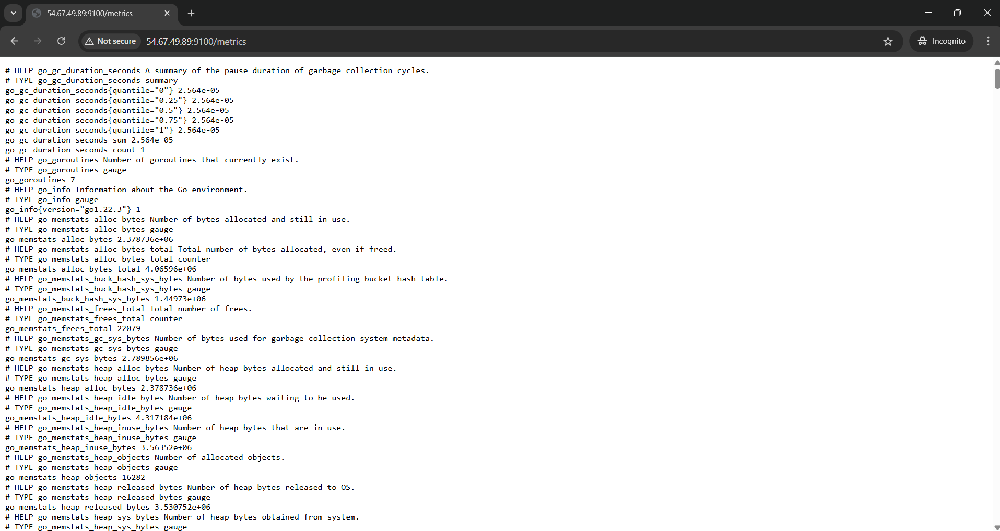
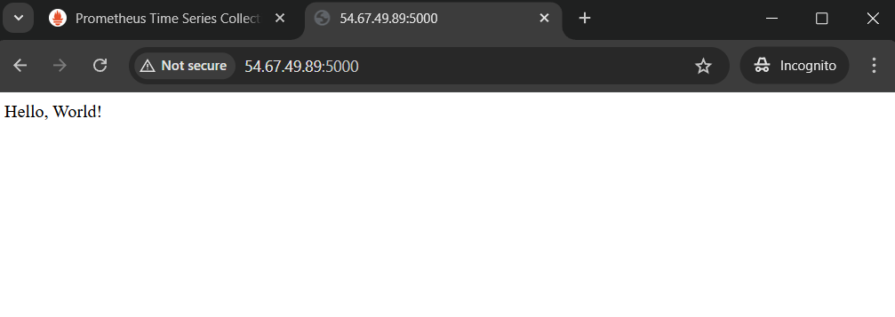

# Prometheus Installation with Python App Monitoring

##  Project Overview

This project demonstrates the complete installation and configuration of:

- Prometheus
- Node Exporter
- Python Flask Application
- Custom Metrics Monitoring
- CPU Usage Monitoring

All services are installed and configured on an AWS EC2 Ubuntu 22.04 LTS instance.


##  Architecture

Python App (Port 5000)  
        ↓  
Prometheus (Port 9090)  
        ↓  
Node Exporter (Port 9100)   

Prometheus collects:
- Application metrics
- System metrics (CPU, Memory, etc.)

#  Step 1: Launch EC2 Instance

- Instance Type: t3.micro  
- Operating System: Ubuntu 22.04 LTS  


#  Step 2: Configure Security Group (Inbound Rules)

| Port | Purpose |
|------|----------|
| 22   | SSH |
| 9090 | Prometheus |
| 9100 | Node Exporter |
| 5000 | Python App |

Allow Source: 0.0.0.0/0


#  Step 3: Connect to EC2

```bash
ssh -i your-key.pem ubuntu@YOUR_PUBLIC_IP
```

Update system:

```bash
sudo apt update -y
```

#  Step 4: Install Prometheus

## Create User & Directories

```bash
sudo useradd --no-create-home --shell /bin/false prometheus
sudo mkdir /etc/prometheus
sudo mkdir /var/lib/prometheus
sudo chown prometheus:prometheus /var/lib/prometheus
```

## Download Prometheus

```bash
cd /tmp
wget https://github.com/prometheus/prometheus/releases/download/v2.53.1/prometheus-2.53.1.linux-amd64.tar.gz
tar -xvf prometheus-2.53.1.linux-amd64.tar.gz
cd prometheus-2.53.1.linux-amd64
```

## Move Required Files

```bash
sudo mv prometheus /usr/local/bin/
sudo mv promtool /usr/local/bin/
sudo mv consoles /etc/prometheus
sudo mv console_libraries /etc/prometheus
sudo mv prometheus.yml /etc/prometheus
```

## Set Ownership

```bash
sudo chown -R prometheus:prometheus /etc/prometheus
sudo chown prometheus:prometheus /usr/local/bin/prometheus
```

## Create Prometheus Service File

```bash
sudo vim /etc/systemd/system/prometheus.service
```

Paste:

```
[Unit]
Description=Prometheus
Wants=network-online.target
After=network-online.target

[Service]
User=prometheus
Group=prometheus
Type=simple
ExecStart=/usr/local/bin/prometheus \
 --config.file=/etc/prometheus/prometheus.yml \
 --storage.tsdb.path=/var/lib/prometheus \
 --web.console.templates=/etc/prometheus/consoles \
 --web.console.libraries=/etc/prometheus/console_libraries

[Install]
WantedBy=multi-user.target
```

Start Prometheus:

```bash
sudo systemctl daemon-reload
sudo systemctl start prometheus
sudo systemctl enable prometheus
sudo systemctl status prometheus
```

Access:

```
http://YOUR_PUBLIC_IP:9090
```


#  Step 5: Install Node Exporter

```bash
cd /tmp
wget https://github.com/prometheus/node_exporter/releases/download/v1.8.1/node_exporter-1.8.1.linux-amd64.tar.gz
tar -xvf node_exporter-1.8.1.linux-amd64.tar.gz
sudo mv node_exporter-1.8.1.linux-amd64/node_exporter /usr/local/bin/
sudo useradd -rs /bin/false node_exporter
```

## Create Node Exporter Service

```bash
sudo vim /etc/systemd/system/node_exporter.service
```

Paste:

```
[Unit]
Description=Node Exporter
After=network.target

[Service]
User=node_exporter
Group=node_exporter
Type=simple
ExecStart=/usr/local/bin/node_exporter

[Install]
WantedBy=multi-user.target
```

Start Node Exporter:

```bash
sudo systemctl daemon-reload
sudo systemctl start node_exporter
sudo systemctl enable node_exporter
```

Verify:

```
http://YOUR_PUBLIC_IP:9100/metrics
```



# Step 6: Configure Prometheus to Scrape Node Exporter

Edit Prometheus configuration file:

```bash
sudo vim /etc/prometheus/prometheus.yml
```

Under `scrape_configs:` add:

```yaml
- job_name: 'node_exporter'
  static_configs:
    - targets: ['localhost:9100']
```

Restart Prometheus:

```bash
sudo systemctl restart prometheus
```

# Step 7: Deploy Python Application

## Install Python Dependencies

```bash
sudo apt install python3-pip python3-venv -y
```

## Create Virtual Environment

```bash
python3 -m venv myenv
source myenv/bin/activate
```

## Install Required Packages

```bash
pip install flask prometheus_client
```

## Create Python Application

Create file:

```bash
vim app.py
```

Paste the following code:

```python
from flask import Flask
from prometheus_client import Counter, generate_latest, CONTENT_TYPE_LATEST

app = Flask(__name__)

REQUESTS = Counter('hello_world_total', 'Total Hello World Requests')

@app.route('/')
def hello():
    REQUESTS.inc()
    return "Hello, World!"

@app.route('/metrics')
def metrics():
    return generate_latest(), 200, {'Content-Type': CONTENT_TYPE_LATEST}

if __name__ == '__main__':
    app.run(host='0.0.0.0', port=5000)
```

Save and exit.

## Run Application

```bash
nohup python3 app.py > app.log 2>&1 &
```

## Test Application in Browser

Open:

```
http://YOUR_PUBLIC_IP:5000
```

Refresh multiple times to increase the counter.


# Step 8: Add Python App to Prometheus

Edit Prometheus configuration file again:

```bash
sudo vim /etc/prometheus/prometheus.yml
```

Add under `scrape_configs:`:

```yaml
- job_name: 'python_app'
  static_configs:
    - targets: ['localhost:5000']
```

Restart Prometheus:

```bash
sudo systemctl restart prometheus
```

# Step 9: Verify Metrics in Prometheus

Open Prometheus UI:

```
http://YOUR_PUBLIC_IP:9090
```
In the search bar, type:

```
hello_world_total
```

Click **Execute**.

You should see the counter value increasing every time you refresh:


You should see the counter value increasing when you refresh the Python app.

This confirms:

- Prometheus is running successfully
- Python app is exposing metrics
- Prometheus is scraping custom metrics correctly
- Monitoring setup is working properly


# Monitoring Successfully Configured

✔ Node Exporter metrics collected  
✔ Python application metrics collected  
✔ Custom counter metric visible in Prometheus  
✔ System monitoring working properly  
